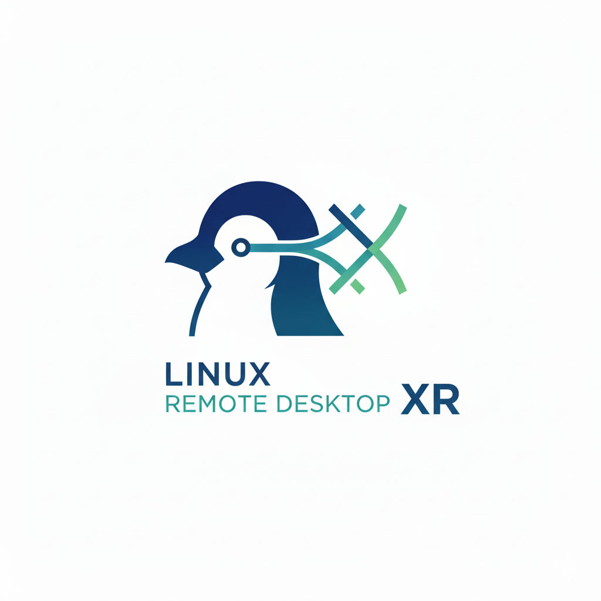

# Linux Remote Desktop XR
Stream your PC desktop as a 2D app to your Meta Quest for easy multitasking.

>[!WARNING]
>
>ALPHA RELEASE
>This project is in a very early alpha stage. It is currently built for a highly specific hardware and software combination. Please do not expect broad compatibility at this time.

## Why This Project?
The primary goal is to create a simple 2D streamer APK for the Meta Quest (and other Android devices).

On the Meta Quest, this allows you to mirror your PC display as a 2D panel that can be used alongside other apps. This is ideal for multitasking—letting you check your desktop, follow a guide, or manage background tasks without leaving VR.

This project is intended for local network use only, assuming your keyboard and mouse remain connected to the host PC.

## Current Features
1080p @ 60fps streaming

Low Latency: <50ms on a stable local network

Cursor Passthrough: Your mouse cursor is mirrored on the stream

Requirements & Compatibility
This is the most critical section for the current alpha. The custom streamer relies on specific hardware encoding. Other setups may work as it's generic enough but I haven't tested it beyond this configuration. I would expect wayland in particular won't work.

Host PC (Streamer):

OS: Ubuntu 24.04

Display Server: X11

Hardware: Intel CPU / iGPU (for hardware encoding)

Client (Viewer):

Any reasonably modern android device.

## How to Use
(This is a general template. We need to fill in the specifics!)

TBD

## Roadmap & Goals
The project's main goal is to improve performance and add features.

[ ] Achieve similar low latency at 4K or 1440p Ultrawide resolutions.

[ ] Add virtual screen support, allowing you to create a screen resolution independent of your physical monitors.

[ ] Widen compatibility (e.g., Wayland, NVIDIA/AMD encoding).

[ ] Turn off physical monitors when connected

[ ] Allow multiple windows (unlikely)
